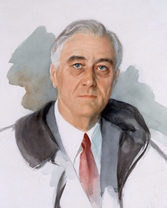

    Julieta Duran Vasquez
    Period 5
    History 17B

# Chapter 26 
## Franklin D. Roosevelt & the New Deal 
### 1932 - 1914

#### *26.1 Rise of Franklin D. Roosevelt*
* FDR projected confidence and optimism,
* FDR came from a wealthy family
* Promising political career
* age thirty-nine contracted polio

>Disease helped him empathize w/ the suffering

#### *26.2 First New Deal*
* FDR's inauguration thousands of banks out of business 

___1933___: FDR declared a national Bank holiday, signed emergency Banking Act, took U.S. off the gold standard, auditors sent nationwide to inspect

___March 1933___: First Fireside Chat,, Reassured Americans,, Explained GOV's action

| Act | What it does | 
| ---------:| -----   |
| Glass-Steagall Act    | Commerical Banks can't invest in stock market,, Created FDIC (insured deposits) |
Economy Act      | Cut Gov. Salaries |     
| Securities Act    | Corporate Financial disclosure |
| New Deal Adjustment Administration (AAA) | Raises prices by reducing product of agriculture |
| Civil Works Administration (CWA) | Employed young men in conservation projects |
| Home owners/Loan Corporation Gov.| Mortages,, People are able to keep homes (extended loans) |
| Public works administration (PWA)| Funded large-scale construction projects |
|Tennessee Valley Authorities (TSA) | Brought electrification & development to rural valley |

### First 100 Days:
* Stabilizing markets
* Providing relief
* Creating jobs
* Supporting Businesses

    ### Assessing the First New Deal
    New deal halted economy's downward spiral

#### ___1933-1935___: employment 24 to 27 mil.

## __Restored public's hope__