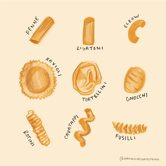

    Julieta Duran Vasquez
    Period 6-7
    Culinary I

># Pasta Notes

#### ___Pasta:___ A starchy food that expands as cooked
* 100 of variations in shapes, sizes & color
* common types include Penne, Spaghetti, Lumacroni, & Fusilli

#### 2 ways to determine quality of Pasta
* ___Flour___: Dry Pasta should contain 100% semolina flour
* ___Freshness___: Dry Pasta = Hard & Brittle

***Dried Pasta***: Purchased in bags & boxes, not brittle, shouldn't break easily, when storing dried pasta temperature should be 50-70F 

***Fresh Pasta***: Made in kitchen, purchased fresh/frozen, wrapped tightly, kept refrigerated

### **Cooking Pasta**

Simple if practicing **mise en place**,

Some dishes require pasta fully cooked.

* Pasta either boiled or baked,, When Pasta is baked it requires partial boiling beforehand

####  ***Boiling***
Can be cooked in large amounts of time, Dried can be cooked ahead of time

**Boiling Pasta**: At least one gallon of water per pound of pasta, Pot large enough for pasta to move,,

1oz of salt per gallon of water

Boil water fully before adding pasta

Test Pasta for Tenderness, Drain w/ Colander

#### ***Baking***
When baked w/ filling & sauce, flavor blends while baking, some cooked then layered in a casserole, (EX: Lasagna)

>Cooking Italian pasta, cook *"Al Dente"* (until pasta tender but still firm)

Each Pasta type has different cooking temps

***Stuffing***: fillings may include cheese, meat, seafoods, poultry & vegetables.

***How to Stuff***: Cook pasta, drain, add sauce too bottom of desired pan, stuff pasta with desired filling, place BACK into baking dish.

## Serving
Pasta should be served immediately