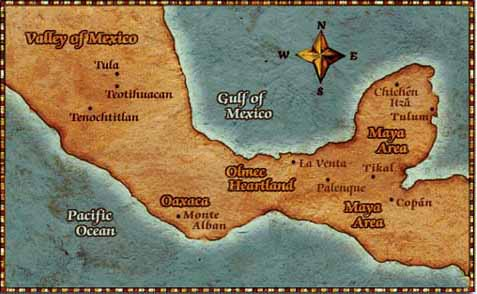

    Julieta Duran Vasquez
    Period 5
    History17A

# Chapter 1: 
## Americas, Europe, and Africa before 1492

>### 1.1 The Americas
According to scholars, people migrated from Asia and people spread across North and South America

_formed diverse society_

__Around 10k years ago__

Agriculture emerged in Mesoamerica

supported population growth and settlements

### The First Americans: The Olmec

Mesoamerica - north of Panama to Central Mexico

Fostered advanced civilizations 

>mesoamerican cultures developed,, 
* Mathematics
* Calenders
* Architecture & written languages

### Olmec Civilization
> #### 1200-400 BC
___"Mother Culture" of Meso-America___
* Colossal stone-head
* pyramids
* irrigation systems

### The Maya

after the Olmec, teotihuacan rose as a major city near modern Mexico City
> population over 100k

Teotihuacan had specialized labor
large apartment complexes,, temples and pyramids
* ritual human sacrifice

_Maya Civilization_ developed advanced mathematics and writing,, as well as calender systems

___Maya City states: Copán, Tikal, Chichenitzá___

Drought and wars led to decline by early 900s